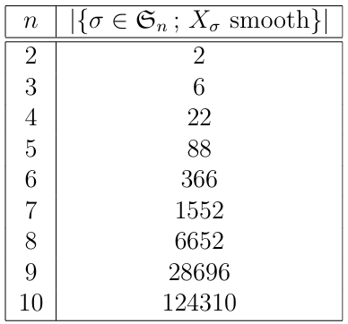

smooth_perm.py calcule le nombre de variétés de Schubert lisses dans la décomposition de Bruhat de GLn. Par le théorème Lakshmibai-Sandhya on sait que la variété de Schubert X(w) est lisse si et seulement si la permutation w évite 3412 et 4231. 

Et length_bruhat_intervals.ipynb calcule les longueurs des intervalles de Bruhat de certaines classes de permutations
